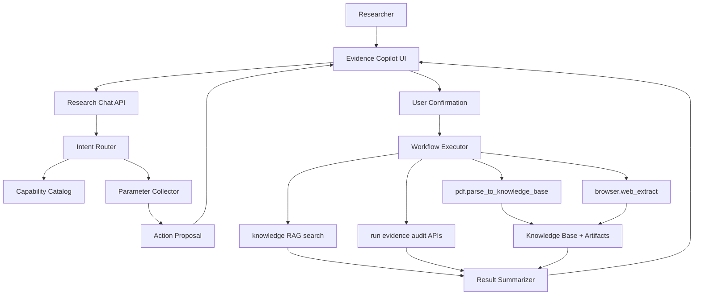
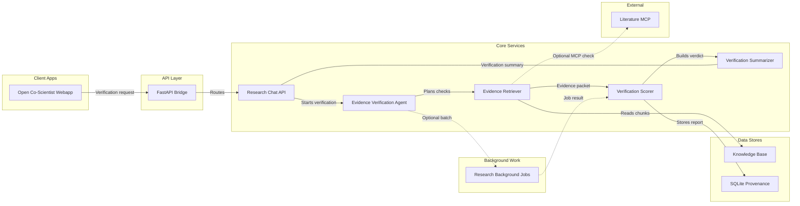

# Evidence Copilot 聊天任务入口设计开发规范

日期：2026-06-29  
状态：正式设计稿 / MVP 已部分落地  
适用范围：`open-coscientist/webapp/` 前端、FastAPI bridge、知识库证据 workflow、research task/provenance 数据层  
默认用户：普通研究用户，不是开发者或系统管理员

## 0. 2026-06-29 落地状态

本轮已完成 MVP 的核心本地实现：

```text
后端：/api/research-chat/capabilities
后端：/api/research-chat/turn
后端：/api/research-chat/actions/{action_id}/confirm
后端：/api/research-chat/actions/{action_id}/cancel
前端：AppShell 级 Evidence Copilot 浮动入口
前端：ResearchChatDrawer、确认卡、结果卡、证据摘要、折叠审计引用
前端：researchChat typed API client
验证：compileall、npm build、TestClient smoke、Playwright preview smoke
```

当前仍未完成：

```text
持久化 research_chat_sessions / messages / action_proposals
approval-backed browser upload workflow
后台 PDF/Web workflow 在聊天助手中的主动选择
专家模式源码索引
Figma design file / Code Connect 同步
```

Figma 说明：本轮已尝试使用 Figma FigJam diagram 生成 Evidence Copilot 架构图，但当前 Figma diagram 工具的 architecture layout 对服务回流 DAG 约束较强，两次生成均被校验拦截；后续若需要可编辑 Figma 画板，应提供目标 design file URL 或允许创建新 design file，并用普通 Figma screen 而不是 architecture-layout diagram 表达该 UI。

## 1. 背景与目标

本规范定义一个 ChatGPT 式的研究任务聊天入口，暂定名为 **Evidence Copilot**。它不是源码问答机器人，也不是绕过系统权限边界的自动 agent，而是面向研究者的自然语言任务入口。

第一版目标是让用户用自然语言完成文献与证据相关任务：

```text
解析 PDF 并写入知识库
抓取网页证据并入库
搜索知识库证据
检查某条假设的证据支撑状态
```

核心原则：

```text
Expose research tasks. Hide implementation complexity. Preserve provenance.
```

用户不需要理解 API、MCP、tool call、run_id、workflow policy、SQLite provenance 等内部结构。系统需要把自然语言转成可确认的研究任务卡片，在用户显式确认后调用现有 approval-backed workflow 或只读查询接口，并返回可审计但不过载的结果摘要。

## 2. 现有系统证据

本设计基于当前 repo 中已经存在的能力，而不是抽象设想。

相关前端与文档：

```text
open-coscientist/webapp/docs/frontend-system-design.md
open-coscientist/webapp/docs/frontend-development-standards.md
open-coscientist/webapp/src/pages/home/HomePage.tsx
open-coscientist/webapp/src/pages/data/DataPage.tsx
open-coscientist/webapp/src/pages/tools/ToolsPage.tsx
open-coscientist/webapp/src/lib/api/workbench.ts
open-coscientist/webapp/src/types/workbench.ts
```

相关后端入口：

```text
GET  /api/tools/registry
GET  /api/tools/toolsets
GET  /api/tools/policies
POST /api/tools/workflows/pdf-parse
POST /api/tools/workflows/pdf-parse/background
POST /api/tools/workflows/web-extract
POST /api/tools/workflows/web-extract/background
GET  /api/knowledge/rag/search
GET  /api/knowledge/papers
GET  /api/knowledge/parse-runs
GET  /api/session-search
GET  /api/runs/{run_id}/evidence-links
GET  /api/runs/{run_id}/evidence-retrievals
POST /api/research-tasks
GET  /api/research-skills
```

已有约束：

```text
PDF 解析、网页证据抓取等写入型工具必须走 approval-backed workflow。
大结果、PDF 全文、网页正文和工具结果必须进入文件或 SQLite，只把摘要和引用注入 UI/LLM 上下文。
普通用户路径不得默认暴露 raw API、provider key、run_id、request_id、stack trace、raw JSON、内部文件路径。
Demo simulation、Live model workflow、Literature-grounded workflow 必须清楚区分。
```

## 3. 产品定位

Evidence Copilot 是研究工作台的 **任务型对话入口**。

它应该回答：

```text
我现在可以做什么证据任务？
这篇 PDF 是否可以解析入库？
这个网页能不能作为证据保存？
知识库里有没有支持某个概念、方法或假设的证据？
某条假设现在是 grounded、limited 还是 ungrounded？
下一步应该解析 PDF、抓取网页、检索知识库还是创建复核任务？
```

它不应该默认回答：

```text
某个函数在哪一行实现？
某个 API 的原始 JSON schema 是什么？
MCP 服务器内部如何调用？
provider key 是否存在？
后端 stack trace 是什么？
如何修改源码？
```

源码索引可以作为未来 admin/developer 模式的独立能力，不进入第一版普通研究者路径。

## 4. MVP 范围

### 4.1 必做能力

第一版只支持四类意图：

| 意图 | 用户示例 | 执行方式 | 默认风险 |
| --- | --- | --- | --- |
| `parse_pdf_to_knowledge_base` | 帮我解析这个 PDF 并入库 | approval 后调用 PDF parse workflow | 写入本地知识库和产物目录 |
| `extract_web_evidence` | 把这个网页保存为证据 | approval 后调用 web extract workflow | public HTTP(S) 抓取和入库 |
| `search_knowledge_evidence` | 找支持这个机制的文献证据 | 只读 RAG search | 只读 |
| `check_hypothesis_grounding` | 这条假设证据够吗 | evidence links、retrievals、RAG search 汇总 | 只读 |

### 4.2 非目标

MVP 不做：

```text
源码问答
自动启动完整假设生成 run
自动运行实验脚本
自动调用任意 MCP 工具
后台无限循环或定时自动执行
无需确认的写入型工具调用
把聊天回答伪装成真实科学发现
展示 raw API、raw JSON、stack trace 或 provider diagnostics
```

## 5. 用户体验模型

### 5.1 入口位置

第一版建议提供两个入口：

| 位置 | 作用 | 行为 |
| --- | --- | --- |
| Home command center | 全局研究任务入口 | 打开 Copilot drawer 或 inline task panel |
| Data page | 文献与证据上下文入口 | 默认聚焦 PDF、网页证据、知识库检索 |

后续可升级为 App Shell 级全局浮层，但 MVP 不要求全局常驻。

### 5.2 默认界面结构

```text
Research Chat Drawer
├── Header
│   ├── 标题：研究证据助手
│   └── 状态：可检索 / 需要检查 / 离线
├── Message List
│   ├── 用户消息
│   ├── 助手澄清问题
│   ├── 确认卡片
│   └── 结果摘要卡片
├── Composer
│   ├── 文本输入
│   ├── 附件入口（PDF）
│   └── 发送按钮
└── Optional Detail Drawer
    ├── 证据详情
    ├── 产物路径
    └── 审计引用
```

默认只显示：

```text
任务标题
一句话摘要
当前状态
下一步主操作
```

用户主动展开后才显示：

```text
tool_name
result_ref
run_id
parse_run_id
paper_id
artifact path
content hash
raw evidence location
```

### 5.3 典型交互

#### 解析 PDF

```text
用户：帮我解析 D:\papers\paper.pdf 并加入知识库
系统：识别为 PDF 解析任务，生成确认卡片
用户：确认执行
系统：调用 pdf.parse_to_knowledge_base workflow
系统：返回解析结果摘要、知识库状态、可检索片段数、实验线索数
```

确认卡片必须包含：

```text
任务：解析 PDF 并写入知识库
输入：文件名或路径摘要
将执行：全文抽取、metadata、语义 chunk、知识库入库
风险：读取本机文件并写入本地知识库
结果：parse run、knowledge paper、evidence chunks、solve/ 产物
操作：确认执行 / 取消
```

#### 抓取网页证据

```text
用户：把 https://example.org/paper 页面作为证据保存
系统：识别 URL，生成网页证据抓取确认卡片
用户：确认执行
系统：调用 browser.web_extract workflow
系统：返回标题、source reliability、是否发现 PDF 链接、是否写入知识库
```

#### 搜索知识库证据

```text
用户：找一下和 kinase inhibitor resistance 相关的 fulltext 证据
系统：调用 /api/knowledge/rag/search
系统：返回按支持强度和来源可靠性排序的证据摘要
```

只读任务不需要 approval 卡片，但仍应展示当前查询范围和 evidence source boundary。

#### 检查假设支撑

```text
用户：这个假设有没有足够证据支撑：...
系统：搜索知识库并汇总 support_level、source_reliability、是否有 parsed fulltext
系统：输出 grounded / limited / ungrounded 判断和下一步建议
```

如果没有 fulltext 或文献 grounding，需要明确标记：

```text
当前只能作为 model-generated proposal / ungrounded hypothesis，不能作为文献审查结论。
```

## 6. 系统架构



### 6.1 前端模块

建议新增：

```text
src/features/research-chat/
  ResearchChatDrawer.tsx
  ResearchChatComposer.tsx
  ResearchChatMessages.tsx
  ActionProposalCard.tsx
  EvidenceResultCard.tsx
  chat-copy.ts
  chat-state.ts
  chat-adapters.ts
```

建议新增 API client：

```text
src/lib/api/researchChat.ts
```

建议新增类型：

```text
src/types/research-chat.ts
```

第一版可复用现有 CSS token 与 `.command-input`、button、status banner、drawer 模式。不要引入新 UI 框架。

### 6.2 后端模块

建议新增：

```text
webapp/backend/research_chat.py
webapp/backend/research_chat_models.py
webapp/backend/research_chat_router.py
```

如果保持单文件 FastAPI 结构，也可以先在 `app.py` 中增加路由，但业务逻辑必须拆到独立模块，避免继续扩大 `app.py`。

### 6.3 数据层

建议新增轻量持久化：

```text
research_chat_sessions
research_chat_messages
research_chat_action_proposals
```

如果实现成本需要收敛，MVP 可只持久化 action proposal 和 result_ref，聊天 transcript 暂存在前端 state。但确认执行的 workflow 结果必须继续进入已有 provenance 结构：

```text
research_tool_calls
research_tool_results
research_background_jobs
research_tasks
knowledge papers/chunks/evidence
```

## 7. Capability Catalog 规范

Capability Catalog 是聊天助手的能力真相源，不是源码索引。

### 7.1 数据来源

第一版能力目录由以下来源合成：

```text
GET /api/tools/registry
GET /api/research-skills
GET /api/knowledge/papers
GET /api/knowledge/parse-runs
静态前端 route/task manifest
docs/frontend-system-design.md 中的用户任务边界
```

### 7.2 能力项 schema

```ts
export type ResearchChatCapability = {
  id: string;
  userTitle: string;
  userSummary: string;
  intent: ResearchChatIntent;
  taskArea: "evidence" | "knowledge_search" | "hypothesis_audit";
  executionMode: "read_only" | "approval_required" | "unsupported";
  approvalScope?: string;
  requiredInputs: Array<{
    key: string;
    label: string;
    type: "text" | "url" | "pdf_path" | "file" | "hypothesis_text" | "run_ref";
    required: boolean;
  }>;
  expectedOutputs: string[];
  groundingBoundary: "parsed_fulltext" | "public_html_best_effort" | "knowledge_base" | "run_audit";
};
```

### 7.3 MVP 能力项

```text
evidence.parse_pdf
evidence.extract_web_page
evidence.search_knowledge
evidence.check_hypothesis_grounding
```

能力目录不得把 raw endpoint 名称作为默认用户可见标题。raw endpoint 只能作为开发者详情。

## 8. Intent Router 规范

### 8.1 路由策略

第一版采用 hybrid router：

```text
1. 规则提取：PDF 路径、PDF URL、普通 URL、明显查询词、假设文本。
2. 本地意图分类：基于关键词和输入形态匹配 MVP intents。
3. 可选 LLM 分类：仅在 provider 可用且用户输入模糊时启用。
4. schema 校验：LLM 输出必须经过固定 schema 校验，不可信输出不得直接执行。
```

弱 provider 或离线状态下，系统应退回 deterministic router，而不是让聊天入口不可用。

### 8.2 意图 schema

```ts
export type ResearchChatIntent =
  | "parse_pdf_to_knowledge_base"
  | "extract_web_evidence"
  | "search_knowledge_evidence"
  | "check_hypothesis_grounding"
  | "clarify"
  | "unsupported";

export type RoutedIntent = {
  intent: ResearchChatIntent;
  confidence: number;
  extractedInputs: Record<string, unknown>;
  missingInputs: string[];
  userFacingReason: string;
};
```

### 8.3 澄清规则

缺少关键参数时，助手只问一个问题：

```text
缺 PDF 路径：请上传 PDF，或输入当前后端能访问的 PDF 路径。
缺 URL：请提供要保存为证据的网页链接。
缺假设文本：请粘贴要检查的假设内容。
意图模糊：你想解析 PDF、抓取网页，还是搜索知识库？
```

不要一次性抛出多个表单问题。

## 9. Action Proposal 规范

写入型任务必须先生成确认卡片。

### 9.1 schema

```ts
export type ResearchChatActionProposal = {
  actionId: string;
  intent: ResearchChatIntent;
  title: string;
  summary: string;
  inputSummary: string;
  operationSummary: string[];
  riskSummary: string;
  expectedResultSummary: string[];
  approvalRequired: boolean;
  approvalScope?: "pdf.parse_to_knowledge_base" | "browser.web_extract";
  executionTarget:
    | "workflow.pdf_parse"
    | "workflow.web_extract"
    | "query.rag_search"
    | "query.hypothesis_grounding";
  requestPreview: Record<string, unknown>;
  hiddenDebug?: Record<string, unknown>;
};
```

### 9.2 展示规则

默认展示：

```text
任务
输入摘要
将执行的步骤
风险
预期结果
确认 / 取消
```

隐藏到详情：

```text
approvalScope
workflow endpoint
run_id
requestPreview raw object
result_ref
artifact path
```

## 10. 执行适配器规范

### 10.1 PDF 解析

聊天助手执行 PDF 解析时必须优先调用：

```text
POST /api/tools/workflows/pdf-parse
POST /api/tools/workflows/pdf-parse/background
```

请求必须包含：

```json
{
  "pdf_path": "D:\\papers\\paper.pdf",
  "phase": "paper_reading",
  "run_id": null,
  "fetch_metadata": true,
  "ingest_to_knowledge_base": true,
  "approval": {
    "confirmed": true,
    "scope": "pdf.parse_to_knowledge_base",
    "reason": "User confirmed Evidence Copilot PDF parse action."
  }
}
```

长耗时或批量场景使用 background endpoint。单个小 PDF 可以同步执行，但 UI 必须显示 loading、disabled 和 aria-busy。

### 10.2 上传 PDF

如果用户通过浏览器上传 PDF，第一版可以沿用现有 upload parse 能力作为兼容路径，但规范要求后续补齐 approval-backed upload workflow：

```text
1. 前端暂存 file。
2. 用户确认。
3. 后端保存到受控上传目录。
4. 将保存后的 pdf_path 交给 pdf.parse_to_knowledge_base workflow。
5. 结果进入 parse run、knowledge base、tool provenance。
```

不允许在用户选择文件后自动解析入库。

### 10.3 网页证据抓取

执行时调用：

```text
POST /api/tools/workflows/web-extract
POST /api/tools/workflows/web-extract/background
```

请求必须包含：

```json
{
  "url": "https://example.org/article",
  "phase": "literature_review",
  "run_id": null,
  "max_bytes": 1000000,
  "max_text_chars": 12000,
  "ingest_to_knowledge_base": true,
  "approval": {
    "confirmed": true,
    "scope": "browser.web_extract",
    "reason": "User confirmed Evidence Copilot web evidence action."
  }
}
```

仅允许 public HTTP(S)。SSRF、内网地址、本地文件 URL、非文本/HTML 内容、伪 PDF 内容必须被后端 guardrail 拒绝。

### 10.4 知识库证据搜索

只读查询调用：

```text
GET /api/knowledge/rag/search?q=...&limit=8
```

可选参数：

```text
paper_id
parse_item_key
support_level
```

结果默认只展示：

```text
论文标题
章节类型
证据摘要
support_level
source_reliability
text_preview
```

### 10.5 假设证据检查

第一版实现顺序：

```text
1. 如果用户提供 run/hypothesis 上下文，读取 evidence links 和 retrievals。
2. 对 hypothesis text 调用 RAG search。
3. 汇总 parsed_fulltext、abstract、metadata、web_evidence 等 source reliability。
4. 输出 grounded / limited / ungrounded 判断。
5. 如果证据不足，生成建议任务，不自动执行。
```

## 11. 后端 API 设计

建议新增统一聊天 API。

### 11.1 创建或继续会话

```text
POST /api/research-chat/turn
```

请求：

```json
{
  "session_id": "optional",
  "message": "帮我解析 D:\\papers\\paper.pdf",
  "context": {
    "page": "data",
    "run_id": null,
    "paper_id": null,
    "language": "zh"
  }
}
```

响应：

```json
{
  "session_id": "chat_...",
  "assistant_message": {
    "kind": "action_proposal",
    "text": "我可以解析这篇 PDF 并写入知识库。请确认后执行。",
    "proposal": {}
  },
  "state": "awaiting_confirmation"
}
```

### 11.2 确认执行

```text
POST /api/research-chat/actions/{action_id}/confirm
```

请求：

```json
{
  "approval": {
    "confirmed": true,
    "scope": "pdf.parse_to_knowledge_base",
    "reason": "User confirmed in Evidence Copilot."
  }
}
```

响应：

```json
{
  "assistant_message": {
    "kind": "result_summary",
    "text": "已完成解析并写入知识库。",
    "result": {}
  },
  "state": "idle"
}
```

### 11.3 取消执行

```text
POST /api/research-chat/actions/{action_id}/cancel
```

取消必须记录 action proposal 状态，但不得调用 workflow。

### 11.4 获取能力提示

```text
GET /api/research-chat/capabilities
```

返回用户任务化能力列表，不返回 raw registry 全量字段。

## 12. 前端状态机

```text
idle
  -> routing
  -> needs_input
  -> awaiting_confirmation
  -> executing
  -> complete
  -> error
  -> idle
```

状态定义：

| 状态 | UI 行为 |
| --- | --- |
| `idle` | composer 可输入，显示建议任务 |
| `routing` | 禁用发送按钮，显示“正在理解任务” |
| `needs_input` | 助手提出一个澄清问题 |
| `awaiting_confirmation` | 显示确认卡片，composer 可继续补充 |
| `executing` | 确认按钮 disabled，卡片 aria-busy |
| `complete` | 显示结果摘要和下一步建议 |
| `error` | 显示可恢复错误，不展示 raw detail |

所有状态变化不得导致 drawer 外部布局 shift。

## 13. 结果摘要规范

### 13.1 PDF 解析成功

必须展示：

```text
标题
页数
知识库片段数
实验线索数
是否已写入知识库
是否可检索
BibTeX 是否获取
下一步建议：检索证据 / 生成研究假设 / 查看解析详情
```

可展开详情：

```text
parse_run_id
paper_id
solve_dir
extracted_text_path
metadata_json_path
chunks_json_path
media asset count
result_ref
```

### 13.2 网页证据成功

必须展示：

```text
网页标题
最终 URL 域名
source_reliability
是否写入知识库
发现的 PDF 链接数量
发现的 supplementary 链接数量
下一步建议：解析发现的 PDF / 搜索相关证据 / 创建复核任务
```

### 13.3 知识库搜索成功

必须展示：

```text
结果数量
top evidence cards
support_level
source_reliability
section_type
text_preview
```

不得默认展示完整 chunk、database_path 或 raw query result。

### 13.4 假设证据检查成功

必须输出：

```text
grounding verdict: grounded / limited / ungrounded
主要支持证据
主要缺口
是否包含 parsed fulltext
是否需要外部 literature grounding
下一步建议
```

真实科学结论必须明确证据边界。没有 grounding 时，只能称为 model-generated proposal。

## 14. UI 设计规范

### 14.1 视觉与布局

必须遵循：

```text
open-coscientist/webapp/docs/frontend-system-design.md
open-coscientist/webapp/docs/frontend-development-standards.md
```

实现规则：

```text
复用 tokens.css 和现有 button/input/drawer/status 样式。
使用 lucide-react 图标。
按钮、输入框、确认卡、结果卡必须有 default/hover/active/disabled/loading/focus-visible 状态。
卡片 radius 默认不超过既有系统标准。
不创建营销式 hero，不做 PPT 式 dashboard。
不把 agent/tool/provider/MCP 作为普通用户默认导航。
```

### 14.2 组件要求

| 组件 | 要求 |
| --- | --- |
| `ResearchChatDrawer` | 负责整体布局、focus trap、Escape 关闭、aria-modal |
| `ResearchChatComposer` | 支持文本、Enter 发送、Shift+Enter 换行、发送 loading |
| `ActionProposalCard` | 固定高度区域，确认/取消按钮，approval 状态 |
| `EvidenceResultCard` | 摘要优先，详情折叠 |
| `CapabilitySuggestions` | 显示 3 个以内任务建议 |
| `ChatStatusBanner` | 表达 offline/degraded/available |

### 14.3 可访问性

```text
Drawer 使用 role="dialog" 和 aria-modal="true"。
执行中按钮使用 aria-busy。
错误使用 role="alert"。
成功/进度使用 role="status"。
所有 icon-only button 必须有 aria-label。
键盘用户必须能进入、确认、取消和关闭。
Focus-visible outline 不得移除。
```

## 15. 安全与权限

### 15.1 Approval 边界

以下任务必须用户确认：

```text
PDF 解析入库
网页证据抓取入库
任何写入 research_tasks / schedules / delegations 的后续增强
任何后台任务
```

以下任务不需要 approval：

```text
只读 capability 查询
只读知识库搜索
只读 session search
只读 evidence link 查看
```

### 15.2 路径与 URL

PDF 路径属于本机敏感信息。默认聊天消息只显示文件名或路径摘要；完整路径只在详情中显示。

URL 必须由后端 guardrail 校验：

```text
只允许 http/https
拒绝 localhost、内网、link-local、file://、ftp://
校验 content type 或内容头
限制 max_bytes 和 max_text_chars
```

### 15.3 错误脱敏

前端不得展示：

```text
raw HTTP response
traceback
provider error detail
API endpoint
request_id
secret/key/token
repair command
raw JSON
```

错误需要转换为任务语言：

```text
PDF 暂时无法解析，请确认文件未加密、未损坏，并且后端依赖可用。
网页证据暂时无法抓取，请确认 URL 可公开访问并返回文本或 HTML 内容。
知识库暂时不可检索，请稍后重试或刷新资料库状态。
```

## 16. Provenance 与审计

聊天助手不得成为 provenance 黑洞。

写入型执行必须保留：

```text
action proposal
approval scope
workflow name
tool call
tool result
result_ref
parse_run_id / paper_id / content_hash
background job id if async
```

只读 evidence search 建议记录：

```text
query
limit
paper_id / run_id context
result count
top evidence refs
```

如果没有 run_id，上述记录可落到 chat session 或 tool result 的 session scope；如果有 run_id，必须关联到 run provenance。

## 17. 数据模型建议

### 17.1 SQLite 表

```sql
CREATE TABLE IF NOT EXISTS research_chat_sessions (
  session_id TEXT PRIMARY KEY,
  title TEXT NOT NULL,
  user_scope TEXT NOT NULL DEFAULT 'researcher',
  page_context TEXT,
  created_at REAL NOT NULL,
  updated_at REAL NOT NULL
);

CREATE TABLE IF NOT EXISTS research_chat_messages (
  message_id TEXT PRIMARY KEY,
  session_id TEXT NOT NULL,
  role TEXT NOT NULL,
  kind TEXT NOT NULL,
  text TEXT NOT NULL,
  metadata_json TEXT NOT NULL DEFAULT '{}',
  created_at REAL NOT NULL
);

CREATE TABLE IF NOT EXISTS research_chat_action_proposals (
  action_id TEXT PRIMARY KEY,
  session_id TEXT NOT NULL,
  intent TEXT NOT NULL,
  status TEXT NOT NULL,
  title TEXT NOT NULL,
  request_json TEXT NOT NULL,
  approval_scope TEXT,
  result_ref_json TEXT,
  error_summary TEXT,
  created_at REAL NOT NULL,
  updated_at REAL NOT NULL
);
```

### 17.2 状态枚举

```text
proposal status:
  proposed
  confirmed
  running
  complete
  cancelled
  error
```

不得把 PDF fulltext、网页正文、完整 tool payload 直接写入 chat message。大结果继续放到现有 artifacts/tool_results。

## 18. LLM 使用边界

Evidence Copilot 可以使用 LLM 帮助理解意图和生成自然语言摘要，但不得把 LLM 输出作为执行事实。

必须遵守：

```text
LLM classification output 必须经过 schema 校验。
LLM 不得自行构造未注册 workflow。
LLM 不得声称工具已执行，执行事实只能来自 workflow response。
LLM 不得把 ungrounded hypothesis 描述成文献结论。
provider 不可用时，router 必须有规则 fallback。
```

如果使用 LiteLLM/provider response schema，必须继续经过 `open_coscientist.schema_sanitizer`。

## 19. 国际化与文案

默认中文，保留英文扩展能力。

文案必须区分：

```text
Demo simulation
Live model workflow
Literature-grounded workflow
Knowledge-base evidence search
Parsed fulltext evidence
Best-effort public HTML evidence
Ungrounded model proposal
```

不要使用：

```text
Google 原始系统
生产级自动科学发现
已证明
真实发现
官方全文 API
```

除非实际证据链满足对应标准。

## 20. 测试计划

### 20.1 后端单元测试

覆盖：

```text
intent routing: PDF path
intent routing: URL
intent routing: knowledge query
intent routing: unsupported request
action proposal schema
approval required enforcement
safe error mapping
capability catalog filtering
```

### 20.2 后端集成测试

覆盖：

```text
PDF parse proposal -> confirm -> workflow response summary
web extract proposal -> confirm -> workflow response summary
RAG search -> summary
hypothesis grounding check -> verdict
duplicate workflow guardrail -> user-facing error
missing tool availability -> degraded state
```

### 20.3 前端测试

覆盖：

```text
drawer open/close/focus trap
composer loading/disabled/focus-visible
confirmation card confirm/cancel
PDF parse loading/success/error state
web extract loading/success/error state
RAG result cards render without layout shift
raw error text is not displayed
internal IDs hidden by default
```

### 20.4 浏览器验证

每次较大前端改动后必须验证：

```text
页面非空
无 framework overlay
console 无相关 error
核心控件可交互
loading/disabled/focus/hover 状态可见
默认页面不呈现为 PPT 式静态仪表盘
普通用户默认看不到 raw API、run_id、stack trace、provider diagnostics
```

建议命令：

```powershell
$OutputEncoding = [Console]::OutputEncoding = [Text.UTF8Encoding]::new($false);
Set-Location .\open-coscientist\webapp
npm run build
```

```powershell
$OutputEncoding = [Console]::OutputEncoding = [Text.UTF8Encoding]::new($false);
python -m compileall .\open-coscientist\webapp\backend
```

## 21. 实施阶段

### Phase 1：前端壳与只读能力

交付：

```text
ResearchChatDrawer
composer
capability suggestions
RAG search intent
hypothesis grounding check MVP
safe result cards
```

不涉及写入 workflow，风险低。

### Phase 2：Approval-backed PDF 与 Web 工作流

交付：

```text
action proposal card
PDF parse workflow adapter
web extract workflow adapter
background job support
result summary cards
tool result/provenance links
```

### Phase 3：持久化聊天会话与任务创建

交付：

```text
research_chat_sessions
research_chat_messages
research_chat_action_proposals
chat-created research_tasks
session search integration
```

### Phase 4：专家模式扩展

可选：

```text
源码能力索引
API/implementation lookup
developer diagnostics
admin-only raw detail inspection
```

此阶段不得影响普通研究者默认路径。

## 22. 验收标准

MVP 完成必须满足：

```text
用户可以用自然语言发起知识库证据搜索。
用户可以用自然语言请求解析 PDF，但必须确认后才执行。
用户可以用自然语言请求网页证据抓取，但必须确认后才执行。
执行结果展示任务摘要、证据状态和下一步建议。
写入型 workflow 保留 approval 和 provenance。
没有 evidence grounding 时，输出明确标注 ungrounded / limited。
默认 UI 不展示 raw API、raw JSON、stack trace、provider key、内部路径。
错误信息是用户可理解、可恢复的任务语言。
前端 build 通过。
后端 compileall 通过。
```

## 23. 开放问题

这些问题不阻塞 MVP，但实现前需要逐项决策：

```text
聊天 transcript 是否第一版持久化，还是先只持久化 action proposal？
上传 PDF 是否立即补 approval-backed upload workflow，还是先复用现有 upload parse 兼容路径？
无 run_id 的聊天工具结果应存入独立 chat scope，还是创建轻量 research task 作为 target_ref？
LLM router 第一版是否启用，还是先完全规则路由？
Evidence Copilot 是 drawer、页面内 panel，还是 Home/Data 两处不同入口？
```

## 24. 证据核验智能体补充规范

证据核验智能体（Evidence Verification Agent）不是自由聊天代理，而是受控 evidence audit 节点。它负责读取本地知识库、run evidence、hypothesis evidence links 和经授权的外部文献/MCP 结果，输出可审计核验报告。

### P0 必做项目

以下三项是证据核验智能体进入可靠研究工作流前的必做项，已同步登记到 `research_tasks`：

| 任务 | 状态 | 验收口径 |
|---|---|---|
| 恢复并验证 MCP 文献服务可用性 | P0 / ready | `mcp.literature_review` health、workflow policy、`pubmed_fulltext` 或等价 search_with_content 工具可用；失败必须返回 limited/failed 状态，不得伪造文献检索。 |
| 实现外部文献反证检索策略 | P0 / ready | 本地核验后，经 approval 搜索 negative result、failed replication、no effect、contradictory evidence，并写入 verification report、tool result 和 evidence retrieval provenance。 |
| 实现更细粒度 PDF section chunking | P0 / ready | PDF parse 不再依赖 `===== Page N =====` 粗粒度文本；必须基于 section tree 生成可追溯 chunks，并进入 `paper_chunks`、`evidence_chunks_fts`、`chunks.json` 和 evidence view。 |

### 两阶段实现

阶段一：read-only 本地核验。

```text
输入：hypothesis_text、可选 run_id、可选 paper_id
证据源：paper_parse_store.rag_search、hypothesis_evidence_links、evidence_retrievals
输出：supported / limited / contradicted / ungrounded、claim checks、missing evidence、possible counter evidence、falsification tests
写入：有 run_id 时写入 research_tool_results 和 research_tool_calls 作为内部 provenance
边界：不调用外部 MCP，不把候选片段包装成真实科学结论
```

阶段二：approval-backed 外部文献/MCP 反证检查。

```text
输入：同阶段一，另需 ToolWorkflowApproval(scope=mcp.literature_review)
工具：现有 /api/tools/workflows/mcp-call，默认 tool_id=pubmed_fulltext
流程：先执行本地核验，再构造反证 query，再调用 literature MCP，最后合并外部候选 evidence packet 重新生成核验报告
写入：MCP tool result、evidence retrieval、verification report、tool call provenance
失败语义：MCP 不可用时返回 failed externalCheck 和 limited/ungrounded 本地报告，不伪造外部核验
```

### 报告契约

```json
{
  "agent": "evidence_verification_agent",
  "phase": "evidence_audit",
  "verdict": "supported | limited | contradicted | ungrounded",
  "support_level": "experimental_data | parsed_fulltext | candidate_evidence | none",
  "confidence": 0.0,
  "items": [],
  "supportingEvidence": [],
  "possibleCounterEvidence": [],
  "claimChecks": [],
  "missingEvidence": [],
  "falsificationTests": [],
  "sourceReliabilitySummary": {},
  "externalCheck": {},
  "resultRef": {}
}
```

### Architecture DAG

该图遵循 architecture layout 的硬性约束：所有节点必须在 subgraph 中；subgraph ID 只允许 `client / gateway / service / datastore / external / async`；`external` 和 `async` 相关边使用 `-.->`；核心 `-->` 链路无环；响应边使用 `<---`。



## 25. 结论

Evidence Copilot 第一版应作为 **文献与证据任务助手** 落地。它的价值不是回答源码细节，而是把现有 PDF 解析、网页证据、知识库检索和假设支撑检查封装成普通研究者能直接使用的自然语言工作流。

正确落地后，它会成为 `open-coscientist/webapp/` 的研究入口层：

```text
用户自然语言
  -> 任务理解
  -> 参数补齐
  -> 明确确认
  -> 受控 workflow
  -> 证据摘要
  -> provenance 引用
  -> 下一步研究任务
```

这条路径符合当前 workspace 的核心边界：任务导向、证据优先、approval-backed execution、可审计、不过度暴露系统内部结构。
