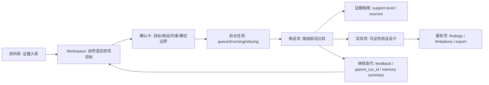

# Open Coscientist 四项论文级能力补齐实施计划书

日期：2026-07-02  
状态：正式实施计划 / 待开发落地  
适用范围：`open-coscientist/` core LangGraph workflow、`open-coscientist/webapp/` FastAPI bridge、前端 research workbench、SQLite knowledge/provenance 数据层  
默认实现策略：SQLite-first，不引入 Redis、Celery 或外部分布式队列  
目标用户：科研工作台使用者、系统实现工程师、产品审查人员

## 0. 结论与目标

当前项目已经具备开源适配版 AI co-scientist workbench 的基础架构：LangGraph 多阶段工作流、chat-first workbench、文献/PDF/网页证据入库、假设生成、review、Elo tournament、agent trace、SQLite provenance 和知识库检索。

但按 Google AI co-scientist 论文语义中的四项能力核对后，仍不能宣称完整达到 paper-level 强定义：

| 能力 | 当前状态 | paper-level 缺口 | 本计划目标 |
| --- | --- | --- | --- |
| 自然语言界面 | 部分满足，偏强 | 用户 starting hypotheses、反馈和约束没有稳定进入主生成循环 | 打通 chat -> RunRequest -> HypothesisGenerator opts -> trace/memory |
| 异步任务框架 | 部分满足 | 只有 async graph 与 BackgroundTasks，没有 durable supervisor queue | 建立 SQLite durable work queue、lease、retry、worker loop |
| 专业化智能体 | 基本满足 | 缺少统一 agent registry、能力声明和稳定 observability contract | 建立可审计、可配置、可扩展的 agent registry |
| 上下文记忆 | 部分满足 | 有审计持久化，但没有 checkpoint/resume 和跨 run memory injection | 增加 execution/research/evidence 三层 memory |

本计划的目标不是重写系统，而是在现有架构上补齐 paper-derived contract，使项目可以准确表述为：

```text
An open, local, source-available AI co-scientist workbench that implements
paper-level architectural parity targets for natural-language supervision,
durable asynchronous task execution, specialized scientific agents, and
persistent contextual memory.
```

仍需保留 attribution 边界：

```text
本项目是基于公开论文思想和 source-available/open-source 项目的本地适配工作台，
不是 Google 官方闭源 AI co-scientist 系统。
```

## 1. 总体架构目标

### 1.1 当前核心实现证据

核心 LangGraph 工作流位于：

```text
open-coscientist/src/open_coscientist/generator.py
open-coscientist/src/open_coscientist/state.py
open-coscientist/src/open_coscientist/nodes/
open-coscientist/src/open_coscientist/prompts/
```

FastAPI bridge 和工作台数据层位于：

```text
open-coscientist/webapp/backend/app.py
open-coscientist/webapp/backend/knowledge_base.py
open-coscientist/webapp/backend/pdf_parser.py
open-coscientist/webapp/backend/evidence_verification_agent.py
```

前端工作台位于：

```text
open-coscientist/webapp/src/features/research-chat/
open-coscientist/webapp/src/features/runs/
open-coscientist/webapp/src/features/hypotheses/
open-coscientist/webapp/src/lib/api/
open-coscientist/webapp/src/types/
```

已有 SQLite 数据层已经覆盖：

```text
research_runs
research_run_timeline
research_hypotheses
hypothesis_evidence_links
evidence_retrievals
research_agent_trace
research_tool_calls
research_tool_results
research_background_jobs
research_tasks
research_schedules
research_delegations
research_chat_sessions
research_chat_messages
research_chat_actions
papers
paper_chunks
paper_parse_runs
paper_parse_evidence
```

这些表是后续 SQLite-first durable queue、memory 和 provenance 扩展的基础。

### 1.2 目标架构

目标架构按四层组织：

```text
Natural Language Control Plane
├── Research chat intent router
├── Confirmation cards
├── Feedback / starting hypotheses / refinement requests
└── User-facing task state

Durable Execution Plane
├── SQLite work item queue
├── Supervisor worker loop
├── Lease / retry / cancellation
├── Run execution handlers
└── Background tool handlers

Specialized Agent Plane
├── LangGraph nodes
├── Agent registry
├── Prompt / schema / tool policy mapping
└── Stable trace events

Contextual Memory Plane
├── Execution checkpoint memory
├── Research memory retrieval
├── Evidence memory / RAG
└── Memory injection into supervisor/generation/review/ranking
```

### 1.3 非目标

第一阶段不做：

```text
分布式多机 worker 集群
Redis / Celery / RabbitMQ 依赖
Google 官方系统源码兼容声明
无确认的写入型工具调用
把 demo/synthetic 输出包装成真实科学发现
普通用户界面默认展示 raw JSON、provider key、内部路径、stack trace
```

### 1.4 实施顺序

推荐按以下顺序开发：

1. 数据层扩展：work items、feedback、memory、checkpoint metadata。
2. Durable worker：enqueue、lease、run handler、retry、status API。
3. 自然语言输入闭环：starting hypotheses、feedback、continuation run。
4. Memory injection：parent run、history、chat、evidence summary 进入 generator opts。
5. Agent registry 与 trace contract 固化。
6. 前端 UI 与测试补齐。

这个顺序先解决最影响 paper-level claim 的两个 blocking 缺口：durable async framework 和 contextual memory。

## 2. 自然语言界面补齐计划

### 2.1 当前状态

当前 chat-first workbench 已支持：

```text
通过自然语言启动 research run
解释当前 run
检查假设
解释 Elo tournament ranking
解析 PDF 并入库
抓取网页证据
搜索知识库证据
核验假设证据支撑
执行本地/SSH 工具任务
```

相关入口：

```text
open-coscientist/webapp/src/features/research-chat/ResearchCommandCenter.tsx
open-coscientist/webapp/src/lib/api/researchChat.ts
open-coscientist/webapp/src/types/research-chat.ts
open-coscientist/webapp/backend/app.py
```

当前缺口：

```text
RunRequest 只承载 research_goal、model、demo/lit、counts 等基础字段。
chat 启动 run 时没有把用户 starting hypotheses、preferences、constraints、feedback 放进主图。
用户可以核验自己的假设，但不能把自己的假设稳定纳入候选池一起 review/ranking/evolution。
用户反馈主要是 post-run inspection，不是下一轮生成的输入 contract。
```

### 2.2 目标行为

自然语言界面应支持科研用户用一段话完成以下操作：

```text
研究目标：找出 VLA 模型任务泛化失败的可证伪机制。
我的初始假设：token 层级动作语法缺失导致长程控制误差累积。
偏好：优先给出最小可验证实验。
约束：不要依赖昂贵真实机器人实验，先用仿真 benchmark。
请把我的假设和模型生成假设一起评审、排序并设计反证实验。
```

系统应生成确认卡，明确展示：

```text
研究目标
用户候选假设数量
偏好和约束摘要
是否基于历史 run 继续
是否启用文献支撑
会调用哪些模型/文献资源
输出包括 hypotheses、reviews、Elo matchups、trace、evidence boundary
```

确认后：

```text
RunRequest 持久化完整自然语言监督输入。
run_real() 将这些字段传给 HypothesisGenerator。
supervisor、literature、generation、review 和 ranking 能读取用户输入。
结果页标记 user_seeded / model_generated / evolved_from_user_seed。
```

### 2.3 RunRequest 扩展

后端 `RunRequest` 增加：

```python
class FeedbackItem(BaseModel):
    feedback_id: Optional[str] = None
    target_type: Literal["run", "hypothesis", "ranking", "evidence", "experiment"] = "run"
    target_ref: Dict[str, Any] = Field(default_factory=dict)
    feedback_type: Literal["accept", "reject", "edit", "prefer", "critique", "constraint"] = "critique"
    text: str = Field(..., min_length=1, max_length=4000)
    created_at: Optional[float] = None

class RunRequest(BaseModel):
    research_goal: str = Field(..., min_length=8)
    model_name: str = "deepseek/deepseek-v4-pro"
    demo_mode: bool = True
    literature_review: bool = False
    initial_hypotheses: int = Field(3, ge=1, le=8)
    iterations: int = Field(0, ge=0, le=3)
    min_references: int = Field(2, ge=0, le=12)
    max_references: int = Field(6, ge=0, le=12)
    preferences: Optional[str] = Field(default=None, max_length=4000)
    attributes: List[str] = Field(default_factory=list, max_length=20)
    constraints: List[str] = Field(default_factory=list, max_length=40)
    starting_hypotheses: List[str] = Field(default_factory=list, max_length=20)
    user_feedback: List[FeedbackItem] = Field(default_factory=list, max_length=50)
    parent_run_id: Optional[str] = Field(default=None, max_length=80)
    refinement_mode: Literal["new_run", "continue_from_run", "revise_hypotheses"] = "new_run"
    memory_scope: Literal["current_run", "project", "library", "global"] = "project"
    library_id: Optional[str] = Field(default=None, max_length=120)
```

前端同步更新：

```text
open-coscientist/webapp/src/types/workbench.ts
open-coscientist/webapp/src/lib/api/workbench.ts
open-coscientist/webapp/src/types/research-chat.ts
```

默认值要求：

```text
preferences/constraints/starting_hypotheses/user_feedback 为空时保持旧行为。
parent_run_id 为空时创建全新 run。
refinement_mode 默认为 new_run。
memory_scope 默认为 project，但只注入摘要，不注入 raw record。
```

### 2.4 Chat intent router 扩展

新增或强化 intent：

| Intent | 用户表达 | 行为 |
| --- | --- | --- |
| `submit_starting_hypothesis` | 我的假设是...请一起评审 | 抽取 hypothesis text，准备纳入候选池 |
| `refine_research_goal` | 把目标改成更可验证 | 生成 refined goal，或创建 continuation proposal |
| `critique_generated_hypothesis` | 第 2 个假设太弱，因为... | 记录 feedback item，关联 hypothesis index |
| `continue_or_revise_run` | 基于上次结果继续演化 | 创建 parent_run continuation proposal |
| `apply_expert_feedback` | 我更偏好第 1 个方向 | 记录 feedback，下一轮进入 memory/context |

路由优先级：

1. 明确工具命令、PDF、URL、web search 仍先走现有 tool intent。
2. 明确“研究目标”且包含“假设/偏好/约束/继续”时走 start/continue run proposal。
3. 明确“检验这个假设是否正确”仍走 verification，不自动纳入候选池。
4. 明确“一起评审/纳入候选/作为 starting hypothesis”才进入主 run。

### 2.5 Chat confirmation card

确认卡应包含：

```json
{
  "executionTarget": "workflow.start_run",
  "approvalScope": "research.start_live_run",
  "requestPreview": {
    "research_goal": "...",
    "starting_hypotheses": ["..."],
    "starting_hypotheses_count": 1,
    "preferences": "...",
    "constraints": ["..."],
    "parent_run_id": "optional",
    "refinement_mode": "new_run",
    "memory_scope": "project",
    "literature_review": true,
    "demo_mode": false
  }
}
```

普通 UI 默认展示摘要：

```text
研究目标
1 条用户候选假设
2 条约束
将启动 Literature-grounded workflow
```

展开后显示可审计字段：

```text
parent_run_id
memory_scope
approval_scope
execution_target
```

不要默认显示 raw JSON。

### 2.6 run_real 数据流

`run_real(record)` 构造 opts：

```python
opts = {
    "enable_literature_review_node": record.request.literature_review,
    "enable_tool_calling_generation": False,
    "preferences": record.request.preferences,
    "attributes": record.request.attributes,
    "constraints": combined_constraints,
    "memory_context": memory_context,
    "user_feedback": [item.model_dump() for item in record.request.user_feedback],
    "user_inputs": {
        "starting_hypotheses": record.request.starting_hypotheses,
        "literature": memory_context.get("literature_refs", []),
    },
}
```

`combined_constraints` 由三部分合成：

```text
用户 constraints
reference_constraints
memory/evidence boundary constraints
```

合成时要保留来源标签，例如：

```text
[user_constraint] ...
[reference_policy] ...
[memory_boundary] ...
```

### 2.7 结果标记

每条 hypothesis 应增加或规范化：

```text
origin: user_seeded | model_generated | evolved | tool_generated
source_starting_hypothesis_index?: number
parent_hypothesis_id?: string
user_feedback_refs?: string[]
evolution_history: string[]
```

如果 core `Hypothesis` 暂不扩展字段，webapp bridge 可在 serialization 后加兼容字段。

### 2.8 自然语言界面测试

新增测试：

```text
test_research_chat_start_run_with_starting_hypothesis
test_research_chat_user_hypothesis_verification_does_not_start_run_without_confirmation
test_research_chat_feedback_records_target_hypothesis
test_run_real_passes_user_inputs_to_hypothesis_generator
test_extended_run_request_round_trips_through_sqlite
```

验收：

```text
用户输入“研究目标：...；我的假设是 ...；请一起评审排序”
-> response 是 action_proposal
-> proposal.requestPreview.starting_hypotheses 长度为 1
-> confirm 后 persisted run.request.starting_hypotheses 长度为 1
-> run_real 调用 HypothesisGenerator 时 opts.user_inputs.starting_hypotheses 非空
```

## 3. 异步任务框架补齐计划

### 3.1 当前状态

当前系统有三类异步能力：

```text
LangGraph async nodes
FastAPI BackgroundTasks for selected tool workflows
asyncio.create_task for /api/runs
```

已有 SQLite 表：

```text
research_background_jobs
research_tasks
research_schedules
research_delegations
```

当前缺口：

```text
/api/runs 创建 run 后直接 asyncio.create_task，任务只活在当前进程事件循环。
后端重启后 queued/running run 只能 stale recovery，不能 lease/retry/resume。
没有 supervisor worker loop 管理 work item 队列。
没有 durable lease_owner / lease_expires_at，无法防止多 worker 重复执行。
schedule/delegation/background jobs 没有统一 work item contract。
```

### 3.2 目标行为

目标是建立本地 durable task execution framework：

```text
API 创建 run 或工具任务
-> 写入 SQLite work item
-> worker loop 通过 lease 获取任务
-> 执行 phase handler
-> 周期性更新 run/timeline/trace/job 状态
-> 成功写 complete/result_ref
-> 失败按 retry policy 重试或 blocked/error
```

后端重启后：

```text
queued work item 继续等待 worker。
lease expired work item 变成 retrying 或 queued。
running run 不直接 stale error，而是根据 checkpoint/work item 判断恢复或失败。
```

### 3.3 数据模型

新增表 `research_work_items`，不要复用 `research_background_jobs`，避免破坏已有工具任务语义。

```sql
CREATE TABLE IF NOT EXISTS research_work_items (
    work_item_id TEXT PRIMARY KEY,
    run_id TEXT,
    workflow_name TEXT NOT NULL,
    phase TEXT,
    agent_role TEXT,
    status TEXT NOT NULL,
    priority INTEGER NOT NULL DEFAULT 3,
    lease_owner TEXT,
    lease_expires_at REAL,
    attempt_count INTEGER NOT NULL DEFAULT 0,
    max_attempts INTEGER NOT NULL DEFAULT 3,
    arguments_json TEXT NOT NULL,
    result_ref_json TEXT NOT NULL,
    error_message TEXT,
    created_at REAL NOT NULL,
    updated_at REAL NOT NULL
);

CREATE INDEX IF NOT EXISTS idx_research_work_items_status
ON research_work_items(status, priority, created_at);

CREATE INDEX IF NOT EXISTS idx_research_work_items_run
ON research_work_items(run_id, updated_at);

CREATE INDEX IF NOT EXISTS idx_research_work_items_lease
ON research_work_items(status, lease_expires_at);
```

状态机：

```text
queued -> leased -> running -> complete
queued -> leased -> running -> error
queued -> leased -> running -> retrying -> queued
queued -> leased -> blocked
queued -> cancelled
leased/running + lease expired -> retrying -> queued
```

字段语义：

| 字段 | 语义 |
| --- | --- |
| `workflow_name` | `workflow.open_coscientist_run`、`tool.pdf_parse`、`tool.web_extract`、`delegation.parallel_review` |
| `phase` | paper-derived phase，例如 `supervisor`、`literature_review`、`review_critique` |
| `agent_role` | 可选，专业化 agent 角色 |
| `priority` | 1 最高，5 最低 |
| `lease_owner` | worker instance id |
| `lease_expires_at` | 超时后可被重新 lease |
| `attempt_count` | 每次 lease 或执行失败递增 |
| `result_ref_json` | 指向 run、tool_result、artifact 或 delegation result |

### 3.4 KnowledgeBaseStore 方法

新增方法：

```python
def enqueue_work_item(...)
def get_work_item(work_item_id: str) -> Optional[Dict[str, Any]]
def list_work_items(...)
def lease_work_items(owner: str, limit: int, lease_seconds: int) -> list[Dict[str, Any]]
def mark_work_item_running(work_item_id: str, owner: str) -> None
def complete_work_item(work_item_id: str, result_ref: Dict[str, Any]) -> None
def fail_work_item(work_item_id: str, error: str, retryable: bool) -> None
def cancel_work_item(work_item_id: str, reason: str) -> None
def recover_expired_leases(now: Optional[float] = None) -> int
```

Lease 必须用单事务实现：

```text
BEGIN IMMEDIATE
SELECT queued/retrying items ORDER BY priority, created_at LIMIT N
UPDATE status='leased', lease_owner=?, lease_expires_at=?, attempt_count=attempt_count+1
COMMIT
```

同一 `workflow.open_coscientist_run` + `run_id` 只能有一个未终止 work item：

```text
queued
leased
running
retrying
blocked
```

### 3.5 Worker loop

新增模块建议：

```text
open-coscientist/webapp/backend/worker_runtime.py
```

职责：

```python
class ResearchWorkerRuntime:
    def __init__(self, store, handlers, owner, concurrency, lease_seconds, poll_seconds):
        ...

    async def start(self) -> None:
        ...

    async def stop(self) -> None:
        ...

    async def tick(self) -> Dict[str, Any]:
        ...
```

FastAPI startup：

```text
如果 COSCIENTIST_WORKER_ENABLED=1，启动 worker loop。
测试环境可设置 COSCIENTIST_WORKER_ENABLED=0，使用 /api/worker/tick 手动推进。
```

配置：

```text
COSCIENTIST_WORKER_ENABLED=1
COSCIENTIST_WORKER_CONCURRENCY=1
COSCIENTIST_WORKER_LEASE_SECONDS=300
COSCIENTIST_WORKER_POLL_SECONDS=2
COSCIENTIST_WORKER_OWNER=hostname:pid:uuid
```

### 3.6 Work item handlers

v1 需要这些 handler：

| workflow_name | handler | 说明 |
| --- | --- | --- |
| `workflow.open_coscientist_run` | `execute_open_coscientist_run_work_item` | 执行 demo/live run |
| `tool.pdf_parse` | existing PDF background handler wrapper | 可逐步迁移 |
| `tool.web_extract` | existing web background handler wrapper | 可逐步迁移 |
| `tool.code_analysis` | existing code analysis job wrapper | 可逐步迁移 |
| `tool.experiment_job` | existing experiment job wrapper | 可逐步迁移 |
| `tool.terminal_command` | existing terminal job wrapper | 可逐步迁移 |
| `tool.ssh_training_command` | existing SSH job wrapper | 可逐步迁移 |
| `delegation.parallel_review` | existing delegation runner wrapper | 后续迁移 |

第一阶段必须迁移 `/api/runs`，其他工具可以保留 BackgroundTasks，并在计划中标记为 phase 2 migration。

### 3.7 `/api/runs` 改造

当前：

```text
create RunRecord
persist_run_record
asyncio.create_task(run_with_guard(record, task))
return run_id
```

目标：

```text
create RunRecord(status="queued")
persist_run_record
enqueue research_work_items(workflow_name="workflow.open_coscientist_run", run_id=run_id, arguments={demo_mode,...})
return run_id + work_item_id
```

当 worker disabled 时：

```text
仍创建 queued run 和 work item。
API 返回 queued。
前端提示“后台 worker 未启用，需启动 worker 或手动 tick”。
不再静默 fallback 到 asyncio.create_task，避免状态语义不一致。
```

### 3.8 Worker status API

新增：

```text
GET  /api/worker/status
POST /api/worker/tick
```

`GET /api/worker/status` 返回：

```json
{
  "enabled": true,
  "owner": "host:pid:uuid",
  "concurrency": 1,
  "lease_seconds": 300,
  "poll_seconds": 2,
  "running_count": 1,
  "queued_count": 3,
  "retrying_count": 0,
  "leased_count": 1,
  "last_tick_at": 1783000000.0
}
```

`POST /api/worker/tick`：

```text
仅用于测试/管理员手动推进。
执行一次 recover_expired_leases + lease + handler dispatch。
```

### 3.9 异步框架测试

新增测试：

```text
test_work_item_enqueue_and_lease_is_atomic
test_work_item_duplicate_run_prevention
test_work_item_complete_updates_result_ref
test_work_item_retry_after_handler_error
test_work_item_lease_expiry_recovers_to_retrying
test_create_run_enqueues_work_item_without_create_task
test_worker_tick_executes_demo_run
test_worker_disabled_keeps_run_queued
test_worker_status_reports_counts
```

验收：

```text
创建 run 后 SQLite 中存在 research_work_items 记录。
worker tick 后 run 从 queued -> running -> complete。
模拟 lease_expires_at 过去后，recover_expired_leases 能恢复任务。
同一 run 不能 enqueue 两个 active open_coscientist_run work item。
```

## 4. 专业化智能体可审计化计划

### 4.1 当前状态

当前 LangGraph 主图已包含：

```text
supervisor
literature_review
generate
reflection
review
ranking
meta_review
evolve
proximity
```

每个节点都有独立实现与 prompt，相关路径：

```text
open-coscientist/src/open_coscientist/nodes/
open-coscientist/src/open_coscientist/prompts/
```

这项能力目前“基本满足”，但缺少统一 registry 和稳定 observability contract。

### 4.2 Agent registry 目标

新增 agent registry，建议位置：

```text
open-coscientist/src/open_coscientist/agents/registry.py
open-coscientist/src/open_coscientist/agents/__init__.py
```

每个 agent metadata：

```python
class AgentSpec(TypedDict):
    agent_id: str
    phase: str
    role: str
    input_contract: Dict[str, Any]
    output_contract: Dict[str, Any]
    prompt_template: str
    tool_policy: Dict[str, Any]
    failure_policy: Dict[str, Any]
    observability_fields: List[str]
    configurable: bool
    degradation_when_disabled: str
```

v1 registry 静态定义，不要求数据库存储。

### 4.3 Agent capability table

| Agent | phase | 输入 | 输出 | 降级语义 |
| --- | --- | --- | --- | --- |
| Supervisor Agent | `supervisor` | research_goal、preferences、constraints、memory_context | research plan、workflow guidance | 不可关闭 |
| Literature Grounding Agent | `literature_review` | research_goal、starting hypotheses、tool registry | articles、reasoning、citation context | 关闭后为 latent-knowledge |
| Hypothesis Generation Agent | `generate` | research plan、literature、starting hypotheses | hypotheses、debate transcripts | 不可关闭 |
| Reflection Agent | `reflection` | hypotheses、literature reasoning | reflection notes | 无文献时跳过 |
| Review Agent | `review` | hypotheses、guidance、meta_review | reviews、scores、safety critique | 不可关闭 |
| Ranking Agent | `ranking` | reviewed hypotheses | tournament matchups、Elo | 不可关闭 |
| Meta-review Agent | `meta_review` | reviews、ranked hypotheses | themes、strategic recommendations | iterations=0 时跳过 |
| Evolution Agent | `evolve` | top hypotheses、review、meta_review | evolved hypotheses、history | iterations=0 时跳过 |
| Proximity Agent | `proximity` | evolved hypotheses | clusters、removed duplicates | iterations=0 时跳过 |

### 4.4 Trace contract

`research_agent_trace` 应稳定记录：

```text
event_id
parent_event_id
agent
role
phase
status
output
tool_calls
token_usage
synthetic
confidence
prompt_template
input_summary
output_summary
degradation_reason
```

如果不迁移表结构，`prompt_template/input_summary/output_summary/degradation_reason` 可先放入 `tool_calls_json` 或 metadata-like structure；推荐迁移表，避免 trace 查询困难。

### 4.5 Agent trace 生成策略

现在 `build_live_agent_trace()` 优先从 LangGraph `messages.metadata.phase` 构造 trace。目标：

```text
每个 node 返回 messages 时必须包含：
metadata.phase
metadata.agent_id
metadata.prompt_template
metadata.synthetic=false
metadata.degradation_reason? 可选
```

示例：

```python
"messages": [
    {
        "role": "assistant",
        "content": "Reviewed 5 hypotheses (comparative batch)",
        "metadata": {
            "phase": "review",
            "agent_id": "hypothesis_review_agent",
            "prompt_template": "review_batch.md",
            "strategy": "comparative_batch",
            "synthetic": False,
        },
    }
]
```

### 4.6 API

新增或扩展：

```text
GET /api/agents/registry
GET /api/runs/{run_id}/trace
```

`GET /api/agents/registry` 返回普通用户可读摘要，专家字段默认可隐藏：

```json
{
  "agents": [
    {
      "agent_id": "supervisor_agent",
      "phase": "supervisor",
      "role": "Research planning and workflow guidance",
      "configurable": false,
      "degradation_when_disabled": "not_supported"
    }
  ]
}
```

### 4.7 前端展示

前端不新增普通导航项。继续在结果工作区的“过程与证据”或专家详情中展示：

```text
阶段
智能体角色
状态
一句话输出
工具调用数量
证据边界
展开后显示 prompt/template 和 trace metadata
```

不要在普通首页暴露 `Agent`、`Workflow internals`、`MCP`、`Vector DB` 等系统结构。

### 4.8 专业化智能体测试

新增测试：

```text
test_agent_registry_contains_all_paper_derived_agents
test_agent_registry_degradation_labels_are_present
test_live_agent_trace_preserves_agent_id_and_prompt_template
test_disabled_literature_review_trace_marks_latent_knowledge_boundary
test_agent_trace_api_returns_stable_phase_order
```

验收：

```text
每个实际执行 phase 都有 trace。
每条 trace 能定位 agent_id、phase、role、prompt_template。
关闭 literature review 后 trace 明确标注 evidence boundary degradation。
```

## 5. 上下文记忆补齐计划

### 5.1 当前状态

当前系统已有：

```text
SQLite research run persistence
SQLite chat session persistence
tool results / tool calls / evidence retrievals
PDF/web evidence knowledge base
FTS/RAG-like chunk search
LLM response cache
```

当前缺口：

```text
LangGraph compile() 没有 checkpointer。
generate_hypotheses() 每次从 fresh initial_state 开始。
run_id 没有作为 thread_id 进入 LangGraph checkpoint。
历史 run/chat/feedback 不会自动检索后注入下一次 supervisor/generation。
LLM cache 容易被误解成 memory，需要明确它只是请求级缓存。
```

### 5.2 三层记忆模型

#### 5.2.1 Execution memory

目的：

```text
支持运行时 checkpoint、resume、重启恢复和 phase-level state tracking。
```

内容：

```text
LangGraph checkpoint state
thread_id = run_id
current phase
completed phases
last checkpoint time
checkpoint backend metadata
```

#### 5.2.2 Research memory

目的：

```text
支持跨 run 的科学推理上下文延续。
```

来源：

```text
research_runs
research_hypotheses
research_chat_messages
research_tool_results
research_tasks
research_delegations
user feedback
experiment results
```

注入内容：

```text
parent run summary
top hypotheses
rejected hypotheses
user preferences and critiques
previous Elo / review patterns
known evidence gaps
recommended next experiments
```

#### 5.2.3 Evidence memory

目的：

```text
让科学结论优先使用 parsed fulltext、PDF chunks、web evidence 和 MCP provenance。
```

来源：

```text
papers
paper_chunks
paper_parse_evidence
hypothesis_evidence_links
evidence_retrievals
research_tool_results
```

注入内容：

```text
relevant parsed_fulltext snippets
source reliability summary
support level summary
possible counter-evidence
experiment_data_summary
```

### 5.3 Checkpointer 实现

新增依赖评估：

```text
当前 pyproject 只有 langgraph~=1.0.6。
实现前确认该版本对应的 SQLite checkpoint package 名称和 API。
优先使用 LangGraph 官方 SQLite checkpointer。
如果官方 package 不可用，先实现 checkpoint metadata 表和 phase-level resume guard，不自研完整 state saver。
```

目标代码形态：

```python
def _build_graph(self, enable_literature_review_node: bool = True, checkpointer: Any = None):
    ...
    return workflow.compile(checkpointer=checkpointer) if checkpointer else workflow.compile()
```

`generate_hypotheses()` 调用：

```python
config = {
    "recursion_limit": 100,
    "configurable": {
        "thread_id": run_id,
    },
}
final_state = await self._graph.ainvoke(initial_state, config=config)
```

### 5.4 Checkpoint metadata 表

新增表：

```sql
CREATE TABLE IF NOT EXISTS research_checkpoints (
    checkpoint_id TEXT PRIMARY KEY,
    run_id TEXT NOT NULL,
    thread_id TEXT NOT NULL,
    phase TEXT,
    status TEXT NOT NULL,
    checkpoint_backend TEXT NOT NULL,
    checkpoint_ref TEXT,
    state_summary_json TEXT NOT NULL,
    created_at REAL NOT NULL,
    updated_at REAL NOT NULL
);

CREATE INDEX IF NOT EXISTS idx_research_checkpoints_run
ON research_checkpoints(run_id, updated_at);
```

这个表不是替代 LangGraph checkpoint backend，而是给 UI、worker 和 recovery policy 使用。

### 5.5 Feedback memory 表

新增表：

```sql
CREATE TABLE IF NOT EXISTS research_feedback (
    feedback_id TEXT PRIMARY KEY,
    run_id TEXT,
    target_type TEXT NOT NULL,
    target_ref_json TEXT NOT NULL,
    feedback_type TEXT NOT NULL,
    text TEXT NOT NULL,
    source TEXT NOT NULL,
    created_at REAL NOT NULL
);

CREATE INDEX IF NOT EXISTS idx_research_feedback_run
ON research_feedback(run_id, created_at);
```

API：

```text
POST /api/runs/{run_id}/feedback
GET  /api/runs/{run_id}/feedback
```

### 5.6 Memory context retrieval

新增数据层方法：

```python
def build_memory_context(
    *,
    research_goal: str,
    parent_run_id: Optional[str],
    library_id: Optional[str],
    memory_scope: str,
    max_runs: int = 5,
    max_hypotheses: int = 8,
    max_evidence: int = 8,
) -> Dict[str, Any]:
    ...
```

返回结构：

```json
{
  "memory_scope": "project",
  "parent_run": {
    "run_id": "...",
    "research_goal": "...",
    "status": "complete",
    "summary": "..."
  },
  "related_runs": [],
  "prior_hypotheses": [],
  "user_feedback": [],
  "evidence_summaries": [],
  "known_gaps": [],
  "memory_boundary": "Summaries only; raw records are not injected."
}
```

### 5.7 Memory injection into prompts

新增 `memory_context` 进入 `WorkflowState`：

```python
memory_context: Optional[Dict[str, Any]]
user_feedback: Optional[List[Dict[str, Any]]]
```

prompt injection 原则：

```text
只注入摘要。
不注入 raw JSON。
不注入全文 chunks，除非已经被检索为 top evidence summary。
必须标注来源：parent_run、chat_feedback、knowledge_base、parsed_fulltext。
必须标注证据边界：limited、ungrounded、parsed_fulltext、public_html_best_effort。
```

优先改：

```text
supervisor prompt：使用 memory_context 做 planning guidance。
generation prompt：使用 prior hypotheses 和 user starting hypotheses。
review prompt：使用 user feedback 和 evidence gaps。
ranking prompt：使用 prior reviewer preferences 但不能覆盖当前 tournament evidence。
```

### 5.8 Memory UI

结果页新增可展开区域：

```text
本次运行使用的上下文
├── 来源：上一轮 run / 当前项目历史 / 文献库证据 / 用户反馈
├── 摘要：3 条历史假设，2 条用户反馈，5 条证据片段
└── 展开：查看来源详情
```

默认只显示：

```text
使用了 1 个历史 run、2 条用户反馈、5 条证据摘要
```

展开后显示：

```text
run_id
feedback_id
paper_id
chunk_id
result_ref
```

### 5.9 上下文记忆测试

新增测试：

```text
test_feedback_is_persisted_and_listed
test_memory_context_uses_parent_run_summary
test_memory_context_retrieves_related_hypotheses
test_memory_context_includes_parsed_fulltext_evidence
test_hypothesis_generator_receives_memory_context
test_checkpoint_metadata_records_phase_status
test_run_resume_uses_thread_id_config
```

验收：

```text
parent run -> feedback -> continuation run 能在 persisted request 和 memory context 中看到。
memory context 注入 supervisor/generation，但不会泄漏 raw JSON。
LLM cache 文档和 UI 不再被描述为 long-term scientific memory。
```

## 6. Public APIs / Interfaces

### 6.1 扩展接口

```text
POST /api/runs
```

接受 extended RunRequest，并返回：

```json
{
  "run_id": "abc123",
  "work_item_id": "work_abc123"
}
```

兼容旧前端：如果前端忽略 `work_item_id`，不影响轮询。

### 6.2 新增接口

```text
POST /api/runs/{run_id}/feedback
GET  /api/runs/{run_id}/feedback
POST /api/runs/{run_id}/continue
GET  /api/runs/{run_id}/memory
GET  /api/worker/status
POST /api/worker/tick
GET  /api/agents/registry
```

### 6.3 状态兼容

`RunRecord.status` v1 保持：

```text
queued | running | complete | error
```

work item 使用更细状态：

```text
queued | leased | running | retrying | blocked | complete | error | cancelled
```

前端普通用户仍只看 run status；专家模式可看 work item status。

### 6.4 错误语义

新增错误 code：

```text
worker_disabled
work_item_not_found
work_item_duplicate_active
work_item_lease_conflict
work_item_retry_exhausted
checkpoint_unavailable
memory_context_unavailable
invalid_refinement_parent_run
```

普通 UI 文案不要直接显示 stack trace。

## 7. 数据迁移策略

### 7.1 SQLite migration 原则

当前 `KnowledgeBaseStore._init_db()` 使用 `CREATE TABLE IF NOT EXISTS` 和 lightweight schema migration。新增表可直接在 `_init_db()` 中创建。

禁止：

```text
删除旧表
重命名旧字段
改变已有 API 返回字段语义
强制清空 .knowledge_base
```

允许：

```text
新增表
新增索引
新增 nullable 字段
新增 JSON 字段
新增后端方法
```

### 7.2 Backfill

历史 run 不需要强制 backfill work items。

读取历史 run 时：

```text
没有 work_item_id -> 视为 legacy direct execution
没有 memory_context -> 视为 none
没有 feedback -> 返回空数组
没有 checkpoint metadata -> status=not_available
```

## 8. 前端实现计划

本节遵循 `webapp/docs/frontend-system-design.md` 和 `frontend-design` skill 的前端产品化口径：先定义用户、任务、信息层级、主操作路径、桌面/移动布局、状态设计和组件清单，再决定把 queue、memory、feedback、agent trace 等论文级能力放到哪里。目标不是增加一个“系统能力展示页”，而是让研究者顺手完成证据准备、假设生成、评审比较、实验设计和报告整理。

### 8.1 类型

更新：

```text
open-coscientist/webapp/src/types/workbench.ts
open-coscientist/webapp/src/types/research-chat.ts
```

新增：

```ts
type FeedbackItem = {
  feedback_id?: string;
  target_type: "run" | "hypothesis" | "ranking" | "evidence" | "experiment";
  target_ref: Record<string, unknown>;
  feedback_type: "accept" | "reject" | "edit" | "prefer" | "critique" | "constraint";
  text: string;
  created_at?: number;
};

type WorkItem = {
  work_item_id: string;
  run_id?: string;
  workflow_name: string;
  phase?: string;
  agent_role?: string;
  status: string;
  priority: number;
  attempt_count: number;
  max_attempts: number;
  updated_at: number;
};
```

### 8.2 Chat UI

`ResearchCommandCenter` 增加：

```text
识别并展示用户初始假设数量
确认卡展示 parent run / continuation / feedback summary
结果卡展示 queued work item 状态
支持“基于当前 run 继续”快捷 prompt
支持“把这条反馈用于下一轮”快捷 action
```

### 8.3 Result UI

结果工作区增加：

```text
Hypothesis origin badge:
  user seeded
  model generated
  evolved
  tool grounded

Memory summary disclosure:
  默认摘要
  展开 provenance refs

Worker status in expert settings:
  enabled
  queued
  running
  retrying
```

UI 约束：

```text
默认不暴露 raw work_item_id、run_id、checkpoint_id。
普通用户路径用“后台队列”“上下文来源”“用户反馈”这类任务语言。
专家展开后可查看精确 ID 和 provenance。
```

### 8.4 页面设计逻辑总则

前端页面不是展示 agent graph，而是帮助研究者完成连续研究任务。每次新增页面、重构页面或把本计划中的 queue、memory、feedback、agent trace 暴露到 UI 前，都必须先回答以下问题：

```text
用户是谁：研究者、评审者、实验执行者、系统管理员，还是开发调试人员。
页面任务是什么：定义目标、准备证据、比较假设、设计实验、整理报告、检查运行状态。
信息层级是什么：当前项目/任务 -> 主要内容 -> 下一步操作 -> 证据/过程详情 -> 专家调试。
主要操作路径是什么：用户从哪里进入，完成后去哪里。
桌面布局是什么：主工作区、控制区、详情区如何分配。
移动布局是什么：哪些区域折叠成 tabs、drawers 或 bottom sheets。
状态有哪些：empty、loading、streaming、queued、running、complete、error、offline、permission denied。
组件清单是什么：输入框、确认卡、列表、详情抽屉、状态条、badge、tabs、toast。
可用性风险是什么：信息过载、内部术语外露、状态不可信、操作入口重复、移动端拥挤。
```

设计原则：

```text
以任务为中心，不以 Agent / Workflow / Memory / MCP / Vector DB 为中心。
首屏必须让用户 3 秒内知道：当前项目是什么、当前任务是什么、下一步能做什么。
普通用户只看到任务状态和下一步；审计、trace、checkpoint、work item、raw refs 放入详情或专家模式。
页面密度可以高，但必须可扫描：左侧导航/列表，中间主内容，右侧上下文详情。
不要做宣传页式 hero；这是科研工作台，首屏应直接可操作。
不要把 demo、live、literature-grounded 三种语义混在一个视觉状态里。
```

### 8.5 信息架构与导航

普通研究者导航应保持 goal-driven：

```text
研究主页
研究流程 / Workspace
资料库 / Papers
假设 / Hypotheses
实验 / Experiments
报告 / Reports
研究工具
研究产出
```

不应作为普通导航出现：

```text
Agent
Workflow internals
Memory
Vector DB
MCP
Prompt
Provider key
Raw API
Run ID
Work item
Checkpoint
```

这些系统能力的合理出现位置：

| 系统能力 | 普通用户文案 | 合理位置 | 默认展示 |
| --- | --- | --- | --- |
| durable queue / work item | 后台任务 | 运行进度条、专家设置、运行准备页 | 只显示 queued/running/retrying |
| checkpoint / resume | 可恢复运行状态 | 运行详情、错误恢复提示、专家详情 | 只显示“可恢复/需重试” |
| agent registry | 研究步骤与评审角色 | 过程与证据详情 | 展开后显示 |
| agent trace | 过程记录 | 结果页右侧详情 drawer | 默认摘要 |
| memory context | 本次使用的历史上下文 | Workspace / Hypotheses 的 context disclosure | 默认数量摘要 |
| evidence memory | 文献与证据来源 | Papers、Hypotheses 参考文献抽屉 | 默认 source/support summary |
| provider diagnostics | 运行准备 | Admin / Runtime readiness | 普通用户隐藏 |

### 8.6 页面布局蓝图

#### 8.6.1 研究主页 / Projects

用户任务：

```text
创建新的研究项目，或快速回到最近正在推进的研究。
```

桌面布局：

```text
┌─────────────────────────────────────────────────────────────┐
│ Page title: 研究主页                                         │
├───────────────┬───────────────────────────────┬─────────────┤
│ 最近项目列表  │ 创建/继续研究目标              │ 运行准备摘要 │
│ Active/Recent │ Goal input + primary action    │ Evidence/LLM │
│               │ Suggested next tasks           │ readiness    │
├───────────────┴───────────────────────────────┴─────────────┤
│ 最近产出 / 待处理任务 / 证据准备提醒                         │
└─────────────────────────────────────────────────────────────┘
```

移动布局：

```text
页面标题
创建/继续研究目标
最近项目
运行准备摘要
最近产出
```

合理出现的功能：

```text
研究目标输入
创建项目并生成假设
继续最近项目
证据准备提醒
demo/live/literature-grounded 模式边界提示
```

不应出现：

```text
raw run_id
work_item_id
provider key 状态细节
agent graph 图
```

#### 8.6.2 Workspace / 研究流程

用户任务：

```text
用自然语言定义目标、提交初始假设、确认运行、观察进度、检查结果并继续迭代。
```

桌面布局：

```text
┌────────────────────────────────────────────────────────────────────┐
│ Project header: title, research goal, status, mode boundary         │
├───────────────┬──────────────────────────────────┬─────────────────┤
│ AI Chat       │ Main result canvas               │ Context inspector│
│ Goal/feedback │ Hypotheses / ranking / timeline  │ Evidence/memory  │
│ Confirmation  │ Active run progress              │ trace/details    │
│ Composer      │                                  │                 │
└───────────────┴──────────────────────────────────┴─────────────────┘
```

布局比例建议：

```text
左侧 chat/control: 320-380px
中间主内容: flex 1，最小 560px
右侧 inspector: 320-420px，可折叠
```

移动布局：

```text
顶部项目状态
Tabs: 对话 / 结果 / 证据
对话 composer sticky bottom
inspector 变成 drawer 或 bottom sheet
```

合理出现的功能：

```text
自然语言输入
starting hypotheses 抽取确认
preferences / constraints 摘要
live run 确认卡
queued/running/complete/error 进度
用户反馈快捷 action
继续当前 run / 修订假设
memory summary disclosure
```

状态设计：

```text
empty: 提示用户输入可验证研究目标，不展示空 dashboard。
queued: 显示“已进入后台任务”，不要假装模型已开始推理。
running: 显示当前阶段摘要和可检查 timeline。
worker_disabled: 给出“后台 worker 未启用，需要运行 worker 或管理员 tick”的任务语言。
error: 展示可恢复路径，隐藏 stack trace。
```

#### 8.6.3 Papers / 资料库

用户任务：

```text
准备文献证据，解析 PDF/网页，将证据纳入后续假设生成和核验。
```

桌面布局：

```text
┌──────────────────────────────────────────────────────────────┐
│ Library selector + evidence readiness                         │
├───────────────┬────────────────────────────────┬──────────────┤
│ Library list  │ Papers / parse jobs / search   │ Evidence drawer│
│ Collections   │ Upload, URL, local PDF path     │ Selected paper │
│               │ Candidate table/cards           │ chunks/media   │
└───────────────┴────────────────────────────────┴──────────────┘
```

移动布局：

```text
Library selector
Primary actions: 上传 PDF / 解析路径 / 搜索
Paper cards
Evidence drawer as bottom sheet
```

合理出现的功能：

```text
library selector
PDF parse and ingest
web evidence extraction
MCP/source availability summary
parse progress
source reliability
support level
PDF reader / parse action separation
```

不应出现：

```text
raw MCP payload
SQLite path
local absolute path by default
chunk ids by default
false BibTeX generation from guessed metadata
```

#### 8.6.4 Hypotheses / 假设页面

用户任务：

```text
比较候选假设，理解每条假设的证据、review、ranking，并选择下一步实验或继续迭代。
```

桌面布局：

```text
┌────────────────────────────────────────────────────────────────┐
│ Hypotheses header: count, mode, evidence boundary, primary action│
├────────────────┬───────────────────────────────┬───────────────┤
│ Hypothesis list │ Selected hypothesis detail     │ Evidence/review│
│ Sort/filter     │ Technical + plain explanation  │ Ranking/trace  │
│ origin badges   │ Experiment next step           │ drawer/tabs    │
└────────────────┴───────────────────────────────┴───────────────┘
```

移动布局：

```text
假设列表
点击进入详情
详情页内 tabs: 概览 / 证据 / 评审 / 排名 / 实验
```

合理出现的功能：

```text
origin badge: user seeded / model generated / evolved / tool grounded
Elo rating and rank
review summary
support level
citation/source trigger
apply feedback
continue/revise from selected hypothesis
design falsification experiment
```

默认显示：

```text
标题
一句话解释
origin badge
Elo/rank
support level
下一步 action
```

展开后显示：

```text
完整 review rubric
tournament matchup reasoning
citation map
agent trace
memory refs
```

#### 8.6.5 Experiments / 实验页面

用户任务：

```text
把选中的候选假设转化为可证伪、可执行、可评估的实验设计。
```

桌面布局：

```text
┌──────────────────────────────────────────────────────────────┐
│ Experiment header: selected hypothesis + validation status     │
├────────────────┬──────────────────────────────┬───────────────┤
│ Hypothesis refs │ Experiment design workspace  │ Evidence/risks │
│ Candidate list  │ Variables, controls, metrics │ Failure modes  │
│                 │ Minimal validation path      │ Alternatives   │
└────────────────┴──────────────────────────────┴───────────────┘
```

合理出现的功能：

```text
可观测变量
对照组
替代解释
关键指标
失败条件
最小可行验证路径
所需 evidence/data
导出到报告
```

不应出现：

```text
把模型建议实验当成已验证结论
没有证据边界的 optimistic proposal
```

#### 8.6.6 Reports / 报告页面

用户任务：

```text
把假设、证据、评审、实验计划和限制条件整理成可审计报告。
```

桌面布局：

```text
┌──────────────────────────────────────────────────────────────┐
│ Report header: project title, mode boundary, export actions    │
├───────────────┬───────────────────────────────┬──────────────┤
│ Outline       │ Report draft editor/preview    │ Citations QA │
│ Sections      │ Findings, evidence, experiment │ Evidence map  │
│               │ limitations                    │ gaps          │
└───────────────┴───────────────────────────────┴──────────────┘
```

合理出现的功能：

```text
finding summary
selected hypotheses
experiment plan
limitations
demo/live/literature-grounded boundary note
citation QA
export/copy
```

默认隐藏：

```text
raw backend payload
tool result JSON
provider diagnostics
internal paths
```

#### 8.6.7 Runtime / Admin / 运行准备

用户任务：

```text
让管理员或高级用户确认模型、文献服务、后台 worker、队列和权限是否可用。
```

桌面布局：

```text
┌──────────────────────────────────────────────────────────────┐
│ Runtime readiness header                                      │
├────────────────┬──────────────────────────────┬──────────────┤
│ Service status  │ Worker / queue status        │ Diagnostics  │
│ LLM/lit/PDF     │ queued/running/retrying      │ Expert logs   │
└────────────────┴──────────────────────────────┴──────────────┘
```

普通研究者不应默认进入该页面。普通页面只展示可理解的 task guidance，例如：

```text
文献服务未准备好：你仍可上传 PDF 或先运行非文献支撑模式。
后台任务未启动：当前运行已排队，需管理员启动后台 worker。
```

### 8.7 页面决策模型

每个页面必须围绕“用户此刻要做的判断”设计，而不是围绕后端模块设计。页面首屏只回答当前判断所需的信息，二级详情再展示证据和过程，专家层才展示内部实现状态。

| 页面 | 用户当前决策 | 首屏优先显示 | 主操作 | 二级操作 | 默认隐藏 |
| --- | --- | --- | --- | --- | --- |
| 研究主页 | 继续哪个项目，或新建哪个研究目标 | 最近项目、当前证据准备度、一个研究目标入口 | 创建/继续研究 | 查看最近产出 | run_id、queue details、provider diagnostics |
| Workspace / 研究流程 | 目标是否足够可验证，是否确认启动或继续 run | 自然语言输入、确认卡、当前 run 状态 | 确认启动/继续 | 添加假设、添加反馈、查看过程 | raw request、checkpoint_id、完整 trace |
| Papers / 资料库 | 当前证据是否足够支撑生成或核验 | library selector、文献数量、解析状态、上传/解析入口 | 上传/解析 PDF | 搜索文献、查看证据片段 | raw MCP payload、chunk ids、local paths |
| Hypotheses / 假设 | 哪个候选假设值得推进 | 假设列表、rank、origin、support level、下一步 | 选择假设并设计实验 | 参考文献、反馈、继续迭代 | full review rubric、raw tournament JSON |
| Experiments / 实验 | 这条假设如何被证伪或最小验证 | 选中假设、变量、对照、指标、失败条件 | 生成/修订实验设计 | 补证据、写入报告 | model prompt、内部评分明细 |
| Reports / 报告 | 哪些发现可以形成可审计输出 | finding、证据、实验计划、限制条件 | 导出/复制报告 | citation QA、补充限制 | raw tool result、provider errors |
| Runtime / 运行准备 | 系统是否能可靠执行长任务 | worker、文献服务、模型、PDF parser 的任务化状态 | 启动/检查运行准备 | 手动 tick、查看诊断 | 普通研究者不可见的 endpoint/env/internal IDs |

页面设计必须满足以下判定：

```text
用户不需要理解 durable queue，也能知道任务已排队还是正在运行。
用户不需要理解 checkpoint，也能知道 run 是否可恢复、需重试或已失败。
用户不需要理解 agent registry，也能知道当前经历了哪些研究步骤和评审角色。
用户不需要理解 memory context，也能知道本次使用了哪些历史结论、反馈和证据摘要。
用户不需要理解 MCP，也能知道文献服务是否可用、证据是否来自 fulltext。
```

### 8.8 端到端研究流转

论文级四项能力在前端中的合理出现顺序应跟随研究任务流，而不是跟随实现层依赖顺序。



关键流转规则：

```text
证据不足时，Workspace 可以启动非文献支撑 run，但必须显示 limited/ungrounded 边界。
用户粘贴自己的假设时，先进入确认卡；用户明确选择“纳入候选池”后才进入主 run。
后台任务状态必须在 Workspace 和 run 结果页可见，但只用 queued/running/retrying/complete/error 这类用户可理解状态。
run 完成后，默认落点应是 Hypotheses，而不是 agent trace 或 raw timeline。
用户在 Hypotheses 中的反馈默认影响下一轮 run / continuation，不伪装成即时可逆控制。
实验页只承诺“实验设计建议”，不把模型输出包装成已验证实验结果。
报告页必须保留 demo/live/literature-grounded 边界和 evidence gap。
```

### 8.9 组件与功能出现契约

新增设计功能应落到稳定组件上，避免同一能力在多个页面以不同规则重复出现。

| 组件 | 出现页面 | 默认内容 | 展开/专家内容 | 必备状态 |
| --- | --- | --- | --- | --- |
| `ResearchGoalComposer` | 研究主页、Workspace | 研究目标输入、可验证性提示、主按钮 | preferences、constraints、attributes | empty、focus、disabled、loading、error |
| `RunConfirmationCard` | Workspace chat | 研究目标、用户假设数量、模式边界、资源提示 | extracted request preview、parent run summary | pending、approved、cancelled、invalid |
| `ModeBoundaryBar` | Workspace、Hypotheses、Reports | demo/live/literature-grounded 标签和一句限制 | provider/evidence readiness details | ready、limited、ungrounded、demo-only |
| `RunProgressStrip` | Workspace、Hypotheses detail | queued/running/retrying/complete/error、当前阶段摘要 | work item、lease、checkpoint、trace refs | queued、leased、running、retrying、complete、error |
| `HypothesisCard` | Hypotheses | title、plain summary、rank/Elo、origin、support level、下一步 | full technical text、review summary | selected、hover、loading evidence、limited evidence |
| `SelectedHypothesisPanel` | Hypotheses、Experiments | 技术假设、解释、实验入口、反馈入口 | evolution history、memory refs、review rubric | selected、empty、partial evidence、error |
| `EvidenceDrawer` | Papers、Hypotheses、Reports | source title、support level、reliability、matched snippets summary | citation map、chunk refs、media、parse artifacts | loading、empty、limited、supported、contradicted |
| `MemoryContextDisclosure` | Workspace、Hypotheses | 历史上下文数量、来源类型、parent run 摘要 | exact refs、feedback excerpts、checkpoint summary | absent、available、stale、partial |
| `AgentProcessDisclosure` | Workspace、Hypotheses、Reports | phase list、完成状态、简短摘要 | agent trace、tool calls、token usage、prompt/template name | collapsed、expanded、partial、failed |
| `FeedbackComposer` | Hypothesis detail、chat | “用于下一轮”的用户反馈文本和目标 | target_ref、feedback type、audit refs | draft、saving、saved、error |
| `ExperimentDesignCanvas` | Experiments | 变量、对照、指标、失败条件、最小验证路径 | alternative explanations、data requirements、risk notes | empty、generated、editing、exported |
| `ReportAssembler` | Reports | findings、evidence、experiment plan、limitations | citation QA、source map、export metadata | draft、needs evidence、ready、exporting |
| `RuntimeReadinessPanel` | Runtime/Admin、专家设置 | worker/model/literature/PDF parser 的可用性摘要 | endpoints、env、lease owners、debug payload | ready、limited、offline、permission denied |

组件文案约束：

```text
按钮必须使用动作动词，例如“生成候选假设”“纳入候选池”“设计实验”“写入报告”。
信息状态必须说明任务影响，例如“文献服务暂不可用，可先上传 PDF 或以 limited 模式继续”。
错误消息必须给恢复路径，不能展示 raw HTTP、provider response、stack trace、request_id。
icon-only action 必须有 aria-label 和 tooltip；未知图标不能作为唯一解释。
loading、disabled、success、warning 状态不得改变控件外部尺寸。
```

### 8.10 功能出现位置规则

新增能力必须出现在符合用户意图的位置：

| 功能 | 入口 | 展示方式 | 不允许的展示方式 |
| --- | --- | --- | --- |
| starting hypotheses | Workspace chat confirmation | 数量、摘要、可编辑列表 | 隐藏在 raw request JSON |
| user feedback | Hypothesis card / chat action | “用于下一轮”反馈记录 | 假装立即改写正在运行的结果 |
| continuation run | Workspace / Hypothesis detail | 基于当前结果继续 | 创建一个看不见上下文来源的新 run |
| durable queue | Run progress | 后台任务状态 | 普通页面暴露 lease_owner |
| memory context | Workspace / Hypotheses disclosure | 来源数量和摘要 | 默认铺开历史 raw messages |
| agent trace | Process and evidence drawer | 阶段摘要、工具调用数 | 普通导航暴露 Agent 页面 |
| evidence links | Reference drawer | source reliability + support level | 把未解析证据标成 fulltext support |
| worker status | Runtime readiness / expert panel | enabled/counts/retrying | 首页默认展示内部队列表 |

### 8.11 四项论文能力的页面落点矩阵

四项论文级能力必须以“用户正在完成的研究任务”出现，而不是以内部系统名出现。每个能力都有一个主页面、一个默认摘要面和一个专家审计面；普通用户不应在首屏直接看到 `agent_id`、`checkpoint_id`、`lease_owner`、raw JSON 或 provider diagnostics。

| 论文能力 | 用户看到的能力名称 | 第一次合理出现的位置 | 默认页面布局 | 展开/专家位置 | 不允许的默认呈现 |
| --- | --- | --- | --- | --- | --- |
| 自然语言界面 | 对话式研究控制 | 研究主页的目标输入、Workspace 左侧 chat/control 栏 | 输入框、可验证性提示、确认卡、下一步建议 | confirmation request preview、intent/debug summary | 把 intent router、prompt、raw request JSON 当成主要 UI |
| 异步任务框架 | 后台运行状态 | Workspace run progress、Hypotheses detail 的运行条 | queued/running/retrying/complete/error、当前阶段、人类可理解恢复路径 | Runtime readiness、专家设置、work item detail | 首页或结果页直接铺 `lease_owner`、worker pid、内部队列表 |
| 专业化智能体 | 研究步骤与评审角色 | 结果页“过程与证据”入口、Hypothesis detail 的过程摘要 | phase list、完成状态、输出摘要、质量/证据边界 | agent registry、prompt/template name、tool calls、token usage | 普通导航暴露 Agent 页面，或要求用户先理解 graph 才能看结果 |
| 上下文记忆 | 使用的历史上下文 | Workspace confirmation、Hypotheses detail、Reports 边界说明 | parent run、反馈数量、证据来源数量、memory scope 摘要 | exact refs、feedback excerpts、checkpoint metadata、retrieval diagnostics | 默认铺开历史 chat messages、raw memory JSON 或把 LLM cache 称为科学记忆 |

运行阶段也决定功能出现方式：

| 阶段 | 主页面 | 应出现的能力 | 设计要求 |
| --- | --- | --- | --- |
| 运行前 | 研究主页、Workspace | 自然语言界面、证据准备、memory summary | 只要求用户确认目标、模式边界、用户假设和约束；不展示后台细节。 |
| 排队中 | Workspace | 异步任务框架 | 显示“已排队/等待后台 worker”，保留取消或稍后查看入口；不要显示假进度。 |
| 运行中 | Workspace、Hypotheses | 异步任务框架、专业化智能体 | 显示当前研究阶段摘要和可检查 timeline；agent trace 只以折叠摘要出现。 |
| 完成后 | Hypotheses、Experiments、Reports | 专业化智能体、上下文记忆、证据记忆 | 默认聚焦候选假设比较、证据边界和下一步实验；过程与来源按需展开。 |
| 继续迭代 | Workspace、Hypotheses | 自然语言反馈、上下文记忆 | 明确反馈会进入下一轮 continuation run；展示 parent run 和历史上下文摘要。 |
| 失败/恢复 | Workspace、Runtime | 异步任务框架、execution memory | 普通用户看恢复路径；专家用户可看 checkpoint、retry、lease expiry 和诊断。 |

页面落地顺序建议：

```text
1. 先把 ResearchGoalComposer、RunConfirmationCard、RunProgressStrip 放到 Workspace 主路径。
2. 再把 HypothesisCard、EvidenceDrawer、FeedbackComposer、MemoryContextDisclosure 做成结果检查路径。
3. 然后补 Experiments 和 Reports，把“可证伪实验设计”和“证据边界报告”做成自然下一步。
4. 最后做 RuntimeReadinessPanel 和 AgentProcessDisclosure 的专家展开细节。
```

这保证论文级能力先服务研究者的主路径，再服务审计和调试，不会让产品变成后台任务管理器或 agent graph 展示器。

### 8.12 响应式与交互状态

桌面端：

```text
优先使用三栏工作台：控制/列表、主内容、上下文详情。
右侧 inspector 必须可折叠，避免挤压主内容。
表格和列表需要固定操作列，避免按钮跳动。
```

平板端：

```text
两栏布局：主内容 + 可折叠详情。
Chat、Evidence、Trace 用 tabs 或 drawer。
```

移动端：

```text
单列布局。
主任务优先：chat composer、selected hypothesis、primary action 不应被详情挤走。
详情区使用 bottom sheet。
触摸目标不小于 44px。
长表格转为 cards。
```

必须定义的状态：

```text
loading: 稳定高度 skeleton 或 task status，不导致 layout shift。
empty: 给出下一步，不显示空指标面板。
queued: 显示后台排队和是否需要 worker。
running: 显示当前阶段、预计下一步和可取消/查看过程入口。
complete: 显示结果、证据边界和下一步。
error: 显示恢复路径，不显示 stack trace。
disabled: 说明为什么不可用。
focus-visible: 所有按钮、输入、tabs、drawer close 都必须可键盘访问。
```

### 8.13 前端验收标准

前端实现完成后，除类型和单元测试外，必须做浏览器验证：

```text
桌面视口：1440x900
移动视口：390x844
页面非空
无 framework overlay
console 无相关 error
主要任务路径可完成
loading/queued/running/error 状态可见
文本不溢出按钮、卡片、tabs、drawer
普通页面不出现 raw JSON、provider key、stack trace、内部路径
expert disclosure 展开后能看到 provenance / trace / worker details
```

推荐前端测试补充：

```text
test_workspace_three_panel_layout_has_primary_task_visible
test_mobile_workspace_uses_tabs_or_drawer_for_details
test_hypothesis_origin_badges_are_visible_without_raw_ids
test_memory_summary_hidden_by_default_and_expandable
test_worker_status_hidden_from_normal_user_surface
test_papers_page_keeps_pdf_reading_and_parsing_actions_separate
test_reports_page_shows_mode_boundary_and_hides_raw_payload
test_run_progress_strip_uses_user_facing_queue_status
test_evidence_drawer_hides_raw_chunks_until_expanded
test_feedback_composer_states_feedback_applies_to_next_run
test_mode_boundary_bar_distinguishes_demo_live_literature_grounded
```

## 9. 测试矩阵

### 9.1 Backend unit tests

```text
RunRequest extended fields validation
FeedbackItem validation
work item enqueue / lease / complete / fail
lease expiry recovery
duplicate active work item prevention
memory context retrieval from parent run
feedback persistence
agent registry completeness
checkpoint metadata persistence
```

### 9.2 Backend integration tests

```text
chat -> proposal -> confirm -> queued run -> worker tick -> complete run
run with starting_hypotheses -> generator opts contains user_inputs
parent run -> feedback -> continuation run -> memory context contains feedback
literature disabled -> trace marks latent knowledge boundary
worker disabled -> run remains queued and reports worker_disabled guidance
```

### 9.3 Frontend tests

```text
research chat can start run with user hypothesis
confirmation card shows starting hypothesis count
run progress handles queued/running/complete/error
memory summary default hidden details
agent trace shows phase-level summaries
worker expert status does not affect normal UI
mode boundary bar distinguishes demo/live/literature-grounded states
run progress strip shows queued/running/retrying without raw work_item_id
evidence drawer hides raw chunk refs until explicit details
feedback composer says feedback applies to next run or continuation
```

### 9.4 Regression tests

```text
existing demo run remains working
existing live run remains working when worker enabled
Elo explanation reads real tournament_matchups
PDF parse and web extract still require approval
session search still returns run/hypothesis/tool_result/task/schedule/delegation
ordinary UI does not expose raw JSON/provider key/stack trace
```

## 10. 分阶段里程碑

### Milestone 1: 数据层与文档契约

交付：

```text
research_work_items 表
research_feedback 表
research_checkpoints 表
KnowledgeBaseStore methods
agent registry static metadata
基础测试
```

验收：

```text
pytest data-layer tests pass
旧 run/papers/chat 数据仍可读取
```

### Milestone 2: Durable run queue

交付：

```text
/api/runs enqueue work item
worker_runtime.py
/api/worker/status
/api/worker/tick
demo run worker execution
live run worker execution
```

验收：

```text
create run 后不再直接 create_task
worker tick 可以完成 demo run
lease expiry recovery 测试通过
```

### Milestone 3: Natural language supervision loop

交付：

```text
extended RunRequest
chat intent extraction for starting hypotheses / feedback / continuation
confirmation card requestPreview
run_real opts passthrough
origin badges in output
```

验收：

```text
用户 starting hypothesis 进入 persisted request 和 generator opts
用户 feedback 可进入 continuation run
```

### Milestone 4: Memory injection

交付：

```text
build_memory_context
memory_context in WorkflowState
supervisor/generation prompt memory summary
/api/runs/{run_id}/memory
memory UI summary disclosure
```

验收：

```text
parent run 和 evidence memory 可被 continuation run 摘要引用
不泄漏 raw JSON
```

### Milestone 5: Agent observability hardening

交付：

```text
GET /api/agents/registry
trace metadata standardization
phase degradation labels
frontend trace summary polish
```

验收：

```text
每个执行 phase 有可审计 agent trace
关闭 literature review 时能看到能力降级标记
```

## 11. 风险与缓解

### 11.1 LangGraph checkpoint 版本风险

风险：

```text
当前 langgraph~=1.0.6，SQLite checkpointer package/API 可能需要额外依赖。
```

缓解：

```text
先实现 checkpoint metadata 和 thread_id config。
再用官方 LangGraph SQLite checkpointer 接入。
如果依赖不可用，不自研完整 checkpoint saver，只标记 execution memory limited。
```

### 11.2 Worker loop 与 FastAPI lifecycle

风险：

```text
开发服务器 reload、测试进程、多 worker uvicorn 配置可能导致重复 worker。
```

缓解：

```text
默认单 worker 本地模式。
用 lease_owner / lease_expires_at 防重复执行。
测试可设置 COSCIENTIST_WORKER_ENABLED=0 后手动 tick。
```

### 11.3 Memory 注入污染科学结论

风险：

```text
历史 run 或用户反馈可能强化错误方向。
```

缓解：

```text
memory_context 必须带来源和边界。
review/ranking 仍独立评估 scientific soundness、novelty、feasibility、safety。
证据不足必须标记 limited/ungrounded。
```

### 11.4 UI 复杂度上升

风险：

```text
queue、memory、agent registry 可能让普通用户界面过载。
```

缓解：

```text
普通路径只显示任务状态和下一步。
trace、work item、checkpoint、memory refs 放在详情/专家展开。
遵守 frontend-system-design.md 的 progressive disclosure。
```

## 12. 最终验收清单

### 自然语言界面

```text
[ ] chat 可抽取 research_goal + starting_hypotheses + constraints
[ ] confirmation card 展示用户候选假设数量
[ ] confirm 后 persisted RunRequest 包含 extended fields
[ ] run_real 将 fields 传入 HypothesisGenerator opts
[ ] 结果能区分 user_seeded / model_generated / evolved
```

### 异步任务框架

```text
[ ] /api/runs 创建 durable work item
[ ] worker 可 lease、run、complete、fail、retry
[ ] 后端重启或 lease expired 后可恢复 queued/retrying
[ ] 同一 run 不会重复 active execution
[ ] worker status API 可用
```

### 专业化智能体

```text
[ ] agent registry 覆盖 9 个 paper-derived agents
[ ] 每个 phase 有 agent_id、role、prompt_template、tool_policy
[ ] trace 中稳定记录 phase/agent/output/tool metadata
[ ] phase disabled 时标记 degradation
```

### 上下文记忆

```text
[ ] feedback 持久化
[ ] memory_context 可基于 parent run / library / project 构造
[ ] execution checkpoint metadata 可记录
[ ] thread_id=run_id 进入 LangGraph config
[ ] memory summary 注入 prompt 且不暴露 raw JSON
```

## 13. 推荐开发分支与提交粒度

建议提交顺序：

```text
1. docs: add paper-level four capabilities implementation plan
2. db: add durable work item and feedback/checkpoint tables
3. api: add worker runtime and worker status endpoints
4. api: enqueue runs through durable worker
5. api: extend run request with natural-language supervision fields
6. core: pass user inputs and memory context into HypothesisGenerator
7. core: add agent registry and trace metadata contract
8. ui: expose starting hypothesis, feedback, memory, and worker summaries
9. test: add queue, memory, chat, and trace coverage
```

每个提交都应保持旧 demo/live 流程可回归。

## 14. 成功声明边界

全部里程碑完成后，可以谨慎声明：

```text
The local Open Coscientist workbench implements paper-level architectural
targets for natural-language supervision, durable asynchronous work execution,
specialized scientific agents, and persistent contextual memory.
```

仍不能声明：

```text
这是 Google 官方 AI co-scientist。
这是 Google 闭源系统的完整复现。
demo 模式输出是真实科学发现。
没有文献/fulltext/MCP 时的结果具备文献支撑。
```

如果 LangGraph runtime-level checkpoint 未实际接入，只能声明：

```text
Execution memory is partially implemented through durable queue and checkpoint metadata;
full LangGraph state resume remains limited.
```
